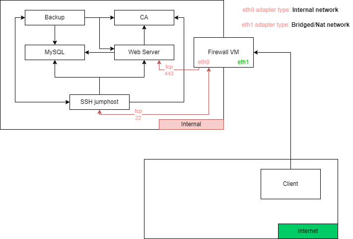

# Backdoors

In this repo you can find the setups and solution files for
the backdoors we implement into the system(s).

Here's a brief overview of our network:

There are two backdoors:
1. [Simple one](./backdoor_simple)
2. [Advanced one(aka g00dluck)](./backdoor_advanced)
